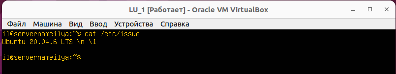
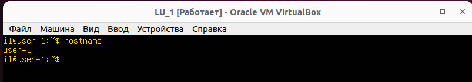
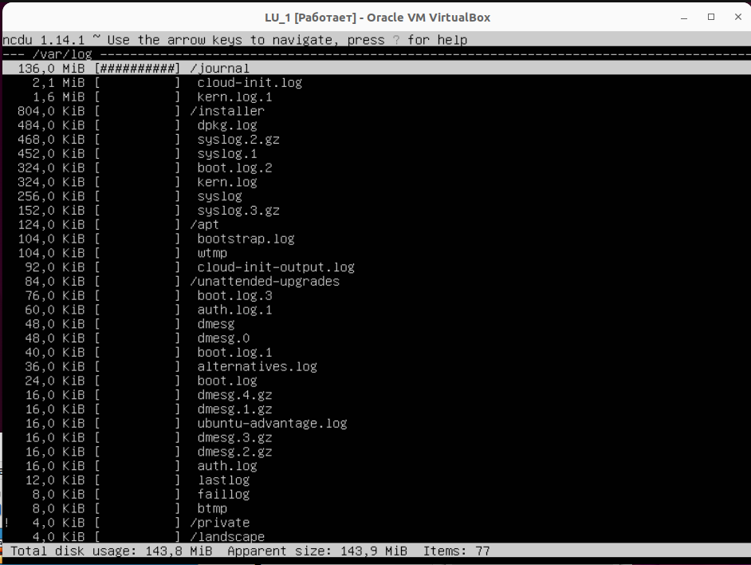

##     Part 1. Установка ОС.
  
  
  
  
  
__ЗАДАНИЕ: установить Ubuntu 20.04 Server LTS без графического интерфейса. (Используем программу для виртуализации - VirtualBox)__
  

  
Продемонстрировна версия Ubuntu, при помощи команды __cat /etc/issue.__
  
##     Part 2. Создание пользователя.
  
  
  
  
__ЗАДАНИЕ: создать пользователя, отличного от пользователя, который создавался при установке. Пользователь должен быть добавлен в группу adm.__
  

  
Cкриншот вызова команды для создания пользователя __"il3"__
  

  
Cкриншот __вызова__ команды __cat /etc/passwd__.
По заданию: "Новый пользователь должен быть в выводе команды cat /etc/passwd"
  

  
Cкриншот вывода команды __cat /etc/passwd__.
  
##     Part 3. Настройка сети ОС
  
  
  
  
  
__ЗАДАНИЕ 3.1: Задать название машины вида user-1.__
  

  
- Cкриншот результата команды `hostname` отображающая  текущее имя машины: _"servernameilya"_.
  
- команда __sudo nano /etc/hostname__ откроет  при помощи редактора nano файл содержащий имя машины 
  

  
Скриншот результата выполнения команды 
__sudo nano /etc/hostname__
  

  
- Изменяем  имя машины на требуемое user-1.
- Нажимаем "Ctr-x" для выхода из редактора Nano.
- Вводим "Y" для сохранения изменнеий в файле.
- Далее перезагружаем ОС при помощи команды __reboot__.
  

  
Видим что имя машины изменилось на "user-1".
  
__ЗАДАНИЕ 3.2: Установить временную зону, соответствующую вашему текущему местоположению.__
  

  
На скриншоте продемонстрирована временная зона установленная по умолчанию, установка временной зоны в соответствии с текущим местоположением и проверка того как были применены изменения.
  
__ЗАДАНИЕ 3.3: Вывести названия сетевых интерфейсов с помощью консольной команды.__
  

  
На скриншоте выведены сетевые интерфейсы.
Сетевой интерфейс __lo__ устанавливается по умолчанию, так как является важной частью сетевой подсистемы и необходим для обеспечения некоторой базовой функциональности системы таких как:
- Обратная связь и тестирование: Интерфейс "lo" позволяет системе обмениваться данными самой с собой без обращения к физической сети. Это важно для отладки и тестирования сетевых приложений, а также для проверки работы сетевых функций без реального сетевого подключения.
  
- Локальный доступ к службам: Используя адрес "localhost" (127.0.0.1), вы можете получить доступ к службам, запущенным на вашем компьютере, таким как веб-сервер или базы данных, даже если они слушают только на локальном интерфейсе. Это позволяет  разрабатывать и тестировать приложения, не взаимодействуя с реальными сетями или внешними компьютерами.
  
- Базовая функциональность: Интерфейс "lo" обеспечивает определенную базовую функциональность операционной системы. Он является частью стандартных сетевых настроек и служит для обмена локальными данными между различными компонентами системы.
  
- Совместимость и стандарты: Присутствие интерфейса "lo" является стандартом для многих операционных систем и соответствует сетевым протоколам и стандартам. Он также обеспечивает совместимость с различными сетевыми приложениями, которые предполагают наличие интерфейса "lo".
  
__ЗАДАНИЕ 3.4: Используя консольную команду получить _ip адрес_ устройства, на котором вы работаете, от DHCP сервера.__
  

  
На скриншоте продемонстрирован ___ip адрес__ виртуальной машины.
  
__DHCP__ (англ. Dynamic Host Configuration Protocol — протокол динамической настройки узла) — сетевой протокол, позволяющий сетевым устройствам автоматически получать IP-адрес и другие параметры, необходимые для работы в сети TCP/IP. Данный протокол работает по модели «клиент-сервер». Для автоматической конфигурации компьютер-клиент на этапе конфигурации сетевого устройства обращается к так называемому серверу DHCP и получает от него нужные параметры. Сетевой администратор может задать диапазон адресов, распределяемых сервером среди компьютеров. Это позволяет избежать ручной настройки компьютеров сети и уменьшает количество ошибок. Протокол DHCP используется в большинстве сетей TCP/IP.
  
__ЗАДАНИЕ 3.5: Определить и вывести на экран внешний ip-адрес шлюза (ip) и внутренний IP-адрес шлюза, он же ip-адрес по умолчанию (gw).__
Внешний IP-адрес шлюза - это публичный IP-адрес, который присваивается вашему маршрутизатору (шлюзу) компьютерной сети, чтобы установить соединение с интернетом. Этот IP-адрес идентифицирует ваш маршрутизатор на глобальном уровне в сети Интернет.
  

  
На скриншоте продемонстрирован внешний IP-адрес шлюза __178.207.154.253__.
  
Внутренний IP-адрес шлюза - это адрес маршрутизатора в локальной сети. Он используется  компьютером для отправки данных к маршрутизатору, который затем перенаправляет эти данные на другие устройства в вашей сети или в интернет.
  

  
На скриншоте продемонстрирован внутренний IP-адрес шлюза __10.0.2.2__, он же ip-адрес по умолчанию (gw).
  
__ЗАДАНИЕ 3.6: Задать статичные (заданные вручную, а не полученные от DHCP сервера) настройки ip, gw, dns (использовать публичный DNS серверы, например 1.1.1.1 или 8.8.8.8).__
  
  

  
Открываем файл конфигурации для сетевых интерфейсов.
  

  
Задаем статичные настройки __ip__, __gw__, __dns__. 
- `network` - блок начала конфигурации.
- `ethernets` - блок конфигурация ethernet протокола.
- `enp0s3` - указываем какой сетевой адаптер будет конфигурировать.
- `dhcp4` - отключает DHCP.
- `addresses` - IP-адрес.
- `gateway4` - Шлюз.
- `nameserver: addresses` - DNS-адрес.
Применяем изменения командой "__sudo netplan apply__"
  
__ЗАДАНИЕ 3.7: Перезагрузить виртуальную машину. Убедиться, что статичные сетевые настройки (ip, gw, dns) соответствуют заданным в предыдущем пункте.__
  
Вводим "__reboot__" для перезагрузки.
  

  
Проверяем __ip__ адрес после перезагрузки командой "__ip a__".
  
  

  
Проверяем __gw__ адрес после перезагрузки командой "__ip route show default__".
  

  
При помощи команды "__systemd-resolve --status__" проверяем адрес __dns__  после перезагрузки.
  
Далее проверяем наличие интернета на машине.
  

  
На скриншоте  успешно пропингованы удаленные хосты 
'1.1.1.1' и 'ya.ru' при помощи команды "__ping__".
В выводе команды есть фраза __"0% packet loss"__ говорящая о том что все пакеты были успешно доставлены.
  
##     Part 4. Обновление ОС
  
  
  
  
  
  
__ЗАДАНИЕ: Обновить системные пакеты до последней на момент выполнения задания версии.__
  

  
На скриншоте  успешно обновлены системные пакеты до последней на момент выполнения задания версии при помощи команды "__sudo apt upgrade__".
  
##     Part 5. Использование команды sudo
  
  
  
  
  
  
__ЗАДАНИЕ: Разрешить пользователю, созданному в Part 2, выполнять команду sudo.__
  
Во второй части мною был создан пользователь "__il3__".
Для того чтобы разрешить пользователю "__il3__" выполнять команду __sudo__ необходимо добавить его  в группу sudoers, используя команду usermod.
  

  
На скриншоте  пользователь "__il3__" успешно добавлен в группу __sudo__
  
__ЗАДАНИЕ: Поменять hostname ОС от имени пользователя, созданного в пункте Part 2 (используя sudo).__
  

  
На скриншоте  сменен текущий пользователь на "__il3__"
  
Далее, поменменяем hostname ОС на __il-3__ от имени пользователя "__il3__" используя команду "__sudo hostnamectl set-hostname il-3__.
  

  
Перезагружаем машину.
  

  
На скриншоте  пользователь "__il__" c hostname ОС "__il3__". 
Ранее имя hostname ОС было "__user-1__".
  
__ЗАДАНИЕ: В отчёте объяснить истинное назначение команды sudo (про то, что это слово - "волшебное", писать не стоит).__
Команда sudo (от "Superuser Do") используется в операционных системах Unix и Linux для выполнения команд с привилегиями суперпользователя или администратора. Суперпользователь (root) имеет полные права доступа ко всем ресурсам и операциям в системе, включая изменение настроек, установку программ и удаление файлов.
  
##     Part 6. Установка и настройка службы времени
  
  
  
  
  
__ЗАДАНИЕ: Настроить службу автоматической синхронизации времени:__
  
- Вывести время, часового пояса, в котором вы сейчас находитесь.
- Вывод следующей команды должен содержать NTPSynchronized=yes: 
timedatectl show
- Вставить скрины с корректным временем и выводом команды в отчёт.
  

  
Вот скриншот вызова и вывода команды __timedatectl__.
  

  
Вот скриншот вызова и вывода команды, которая показывает время в текущей временной зоне.
  
##     Part 7. Установка и использование текстовых редакторов
  
  
  
  
  
  
__ЗАДАНИЕ: Используя каждый из трех выбранных редакторов, создайте файл test_X.txt, где X -- название редактора, в котором создан файл. Напишите в нём свой никнейм, закройте файл с сохранением изменений.__
  

  
Для ввода текстам в _Vim_ необходимо нажать клавишу __i__.
Далее нужно нажать клавишу Esc, чтобы перейти  в режиме команд (Command mode). 
Ввести __:wq__ и клавишу Enter, чтобы выполнить команду.
  

  
nano test_nano.txt
- печатаем имя
- __Ctr + x__ для выхода
- спрашивает сохранить ли изменения пишем __Y__ жмем Enter 2 раза для сохранения в тот же файл.
  

  
Печатаем имя, жмем __Esc__ нас спросят хотим ли мы сохранить изменения , жмем 'Да'.
  
__ЗАДАНИЕ: Используя каждый из трех выбранных редакторов, откройте файл на редактирование, отредактируйте файл, заменив никнейм на строку "21 School 21", закройте файл без сохранения изменений.__
  

  
Для ввода текстам в _Vim_ необходимо нажать клавишу __i__.
Далее нужно нажать клавишу Esc, чтобы перейти  в режиме команд (Command mode). 
Ввести __:q!__ и клавишу Enter, чтобы выполнить команду и выйти без сохранения.
  
  

  
- __nano test_nano.txt__
- печатаем новый текст
- __Ctr + x__ для выхода
- спрашивает сохранить ли изменения пишем __N__ жмем Enter  для выхода без сохранения.
  

  
Печатаем новый текст, жмем __Esc__  нас спросят хотим ли мы сохранить изменения , жмем 'Нет'.
  
  
__ЗАДАНИЕ: Используя каждый из трех выбранных редакторов, отредактируйте файл ещё раз (по аналогии с предыдущим пунктом), а затем освойте функции поиска по содержимому файла (слово) и замены слова на любое другое.__
  

  
Поиск в Vim.
  

  
Замена в Vim.
  
  

  
Поиск в Nano __Ctrl + W__.
  

  
Замена в Nano __Alt + R__.
  
  
  

  
Для поиска слова в MCEDIT жмем __Alt+S__ выбираем нужный пункт поиска.
  

  

  

  
Для замены слова в MCEDIT жмем __Alt+S__ выбираем нужный пункт поиска.
  

  

  
  
##     Part 8. Установка и базовая настройка сервиса SSHD
  
  
  
  
  
  
__ЗАДАНИЕ: Установить службу SSHd. Добавить автостарт службы при загрузке системы. Перенастроить службу SSHd на порт 2022. Используя команду ps, показать наличие процесса sshd. Для этого к команде нужно подобрать ключи.__

  
Установка службу SSHd.
  

  
Добавлен автостарт службы при загрузке системы.
  

  
Открываем файл конфигурации.
  

  
Вносим изменения.
  

  
Перезапускаем службу.
  

  
Используя команду ps, смотрим наличие процесса sshd.
  
Ключ __-C__ в команде ps используется для фильтрации процессов по имени команды (или исполняемого файла). Когда вы добавляете ключ -C и указываете имя команды, ps отобразит только те процессы, у которых имя команды соответствует указанному имени.
  
В контексте команды ps -C sshd, -C sshd указывает на то, что мы хотим отобразить только процессы, которые соответствуют команде sshd. Это позволяет нам найти и проверить наличие процесса sshd (SSH сервера) на нашей системе.
  
Если процесс sshd активен, команда ps -C sshd выведет информацию о нем, включая его идентификатор процесса (PID), статус, использование ресурсов и другие свойства. Если процесс не найден, команда просто не выведет никаких результатов.
 Далее перезагрузка __reboot__.
  
  

  
 Вывод команды netstat -tan содержит tcp 0 0 0.0.0.0:2022 0.0.0.0:* LISTEN
Команда __netstat__ - это утилита командной строки, которая выводит на экран информацию о состоянии сетевых соединений, прослушиваемых портах, таблицах маршрутизации и другую сетевую статистику.
  
`-t` - отображает только TCP-соединения.
  
`-a` - отображает все прослушиваемые порты, включая порты, которые не имеют активных соединений.
  
`-n` - отображает номера портов в числовом формате, а не их имена.
  
Значение каждого столбца вывода команды `netstat -tan`:
  
+ Proto - протокол, используемый для соединения (например, TCP или UDP).
+ Recv-Q - количество байтов, ожидающих чтения из сокета.
+ Send-Q - количество байтов, ожидающих записи в сокет.
+ Local Address - локальный IP-адрес и номер порта.
+ Foreign Address - удаленный IP-адрес и номер порта.
+ State - текущее состояние соединения.
  
В выводе команды __netstat -tan__ значение 0.0.0.0 означает, что процесс прослушивает все доступные сетевые интерфейсы на устройстве. Это называется привязкой к "любому адресу" или "любому интерфейсу".
  
Когда процесс связывается с адресом 0.0.0.0, это означает, что он будет прослушивать все входящие подключения на всех сетевых интерфейсах на устройстве. Это полезно, когда надо, чтобы процесс был доступен из всех интерфейсов и IP-адресов, а не только из определенного интерфейса или IP-адреса.
  
Примеры использования привязки к 0.0.0.0  веб-серверы, которые прослушивают входящие HTTP-запросы от клиентов на всех доступных сетевых интерфейсах, или FTP-серверы, которые принимают входящие FTP-клиентские подключения на всех интерфейсах.
  
##     Part 9. Установка и использование утилит top, htop
  
  
  
  
  
  
__ЗАДАНИЕ: Установить и запустить утилиты top и htop.__
  

  
- uptime - 39 min;
- кол-во авторизованных пользователей - 1;
- общая загрузка системы - 0.00, 0.00, 0.00;
- общие кол-во процессов - Task: 96 total;
- загрузка CPU - %CPU: 0.0 us, 0.0 sy, 0.0 ni, 100 id, 0.0 wa, 0.0 hi, 0.0 si, 0.0 st;
- загрузка памяти - MiB MEM:  1971.4 total, 1320.3 free, 152.8 used, 33498.2 buff/cache;
- 

  
Pid процесса, занимающего больше всего памяти - PID 658 USER root MEM 1,9 COMMAND snapd;
  

  
Pid (один из) процесса,занимающего наибольшее количество процессорного времени -PID 662 USER root MEM 2,6 COMMAND snapd;
  
Далее следуют скриншоты с выводом команд __htop__. Жмем __F6__ и выбираем тип сортировки.
  

  
Соритировка по __PID__.
  

  
Соритировка по __PERCENT_CPU__.
  

  
Соритировка по __PERCENT_MEM__.
  

  
Соритировка по __TIME__.
  

  
Соритировка по __sshd__.
  

  
C процессом __syslog__, найденным, используя поиск.
  

  
Скриншот с  добавленным выводом __hostname, clock и uptime__.
  
##     Part 10. Использование утилиты fdisk
  
  
  
  
  
  
__ЗАДАНИЕ: Запустить команду fdisk -l.__
  

  
/dev/sda, 25 GiB, 5242880 sectors, swap нет на данном диске.
  
##     Part 11. Использование утилиты df
  
  
  
  
  
__ЗАДАНИЕ: Запустить команду df. В отчёте написать для корневого раздела (/): размер раздела, размер занятого пространства, размер свободного пространства, процент использования. Определить и написать в отчёт единицу измерения в выводе.__
  

  
Запуск команды df.
- Размер раздела - 11758760.
- Размер занятого пространства - 4930076.
- Размер свободного простран - 6209576.
- Процент использования - 45%.
  
Единица измерения Килобайт.
  

  
  
  
Запустить команду df -Th.
  
- Размер раздела - 12G.
- Размер занятого пространства - 4.86G.
- Размер свободного простран — 6.0G.
- Процент использования - 45%. 
  
Тип файловой системы ext4.
  
##     Part 12. Использование утилиты du.
  
  
  
  
  
__ЗАДАНИЕ: Запустить команду du. Вывести размер папок /home, /var, /var/log (в байтах, в человекочитаемом виде).__
  

  

  
__du -h /var__
  

  
__du -h /var/log__
  
__ЗАДАНИЕ: Вывести размер всего содержимого в /var/log (не общее, а каждого вложенного элемента, используя *).__
  

  
__du -ha /var/log/*__
  
##     Part 13. Установка и использование утилиты ncdu
  
  
  
  
  
__ЗАДАНИЕ: Вывести размер всего содержимого в /var/log (не общее, а каждого вложенного элемента, используя *).__
  

  
__ncdu /home__
  

  
__ncdu /var__
  

  
__ncdu /var/log__
##     Part 14. Работа с системными журналами
  
  
  
  
  
  
__ЗАДАНИЕ: Открыть для просмотра: 1. /var/log/dmesg 2. /var/log/syslog 3. /var/log/auth.log. Написать в отчёте время последней успешной авторизации, имя пользователя и метод входа в систему. Перезапустить службу SSHd. Вставить в отчёт скрин с сообщением о рестарте службы (искать в логах).__
  

  
 __/var/log/dmesg__ 
  

  
 __/var/log/syslog__
  

  
 __/var/log/auth.log__
  

  
 Время последней успешной авторизации, имя пользователя и метод входа в систему __tty1++__.
 В контексте Linux и UNIX-подобных систем, __tty1__ - это один из виртуальных терминалов (tty), доступных для входа в систему. В каждой системе Linux обычно доступно несколько виртуальных терминалов, помеченных как __tty1__, __tty2__, __tty3__, и так далее, до __tty6__ или даже больше, в зависимости от настроек.
  
Virtuaльные терминалы предоставляют текстовый интерфейс для входа в систему и работы в командной строке. При входе в систему виртуальные терминалы можно использовать для логина пользователей или для работы с командами в текстовом режиме.
  
Вход в систему через __tty1__ означает, что пользователь входит в систему с помощью текстового интерфейса командной строки, а не с графического интерфейса (как, например, с использованием рабочего стола).
  

  
Перезапуск службу SSHd.
  

  
Скрин с сообщением о рестарте службы в var/log/syslog.
  
##     Part 15. Использование планировщика заданий CRON
  
  
  
  
  
  
__Используя планировщик заданий, запустите команду uptime через каждые 2 минуты.__
  

  
__Найти в системных журналах строчки (минимум две в заданном временном диапазоне) о выполнении.__
  

  
__Вывести на экран список текущих заданий для CRON.__
  

  
  
__Удалите все задания из планировщика заданий.__
  

  
  
  
  
  